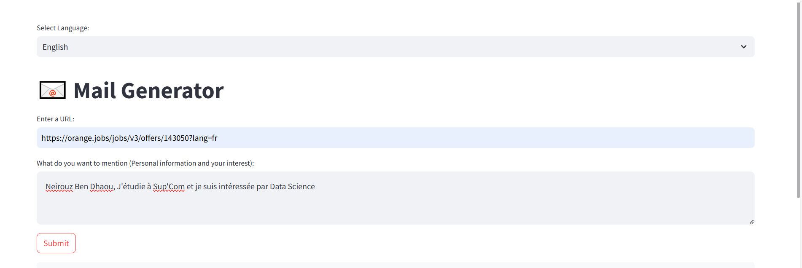
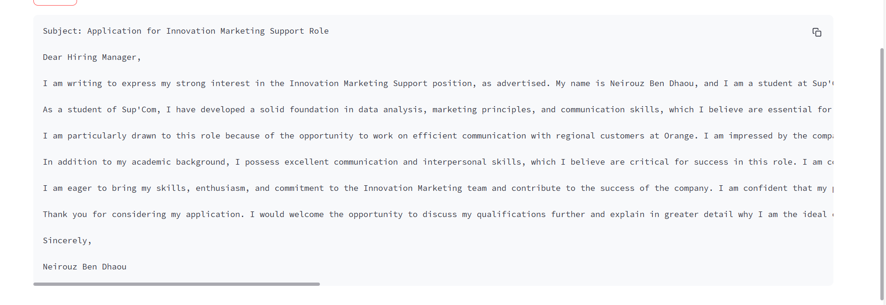
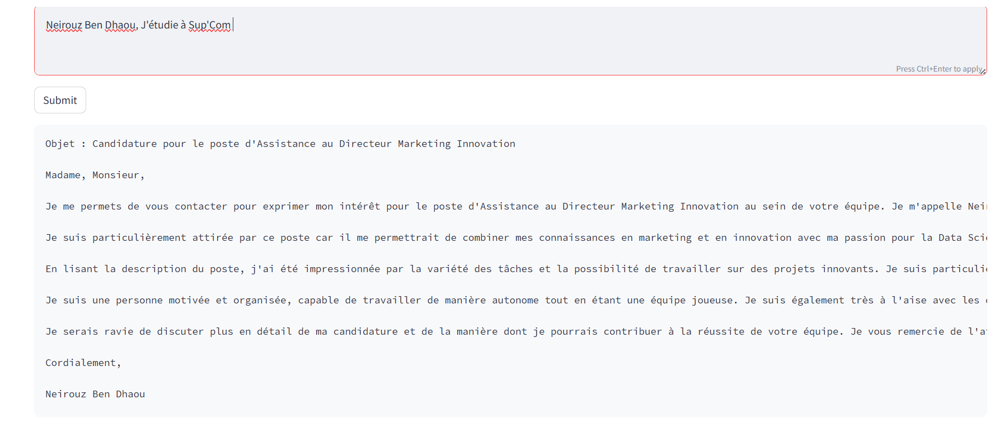

# Project Title

This project is an application designed to assist job seekers in generating a professional email. The user inputs the job URL, selects their preferred language (FRENCH, ENGLISH, or GERMAN), and adds personalized details such as their name, university, and interests to tailor the email.

In this project, I used the LLAMA3 language model developed by Meta, integrated via GrockCloud, a cloud platform specialized in hosting and interacting with advanced LLM models. I also leveraged Langchain, a framework designed to build applications powered by language models, which simplifies integration with external data sources and handles complex query chains and foor job description extraction, I utilized web scraping through Langchain.
## Installation

Instructions for setting up your project locally.

```bash
git clone https://github.com/NeirouzBenDhaou/LLM-Email-Generator.git
cd your-repository
pip install -r requirements.txt
```



### Selecting English


### Selecting French


